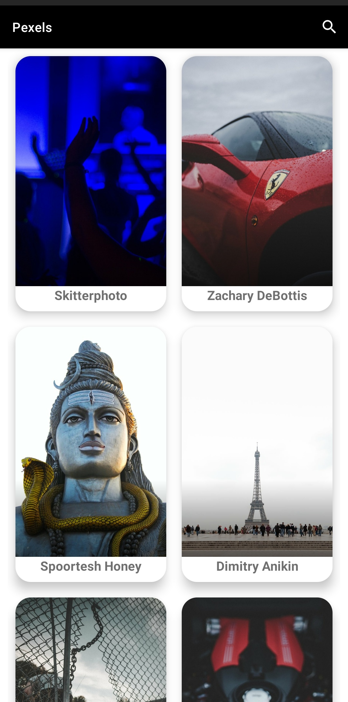
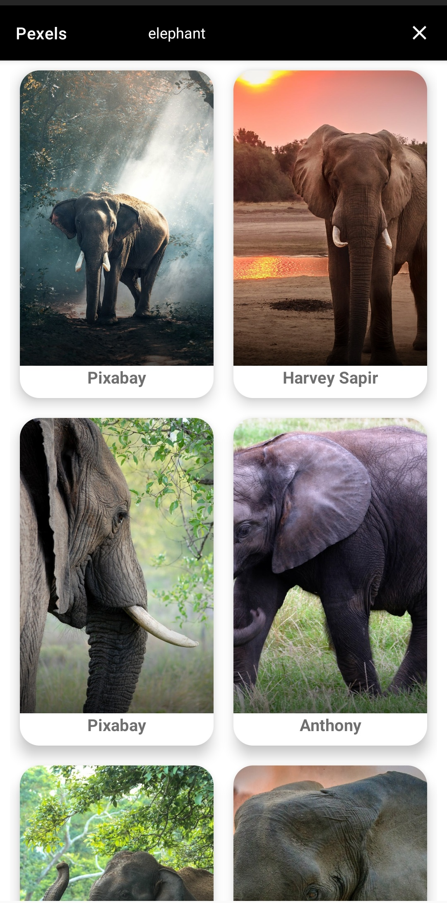

# **PEXELS_DEMO**

---

### A Simple ***MVVM*** Image Application Which Shows Images That Are Obtained Using Pexels API.

---

## API - [Pexels API](https://www.pexels.com/api/)
- ### The Pexels API helps you incorporate the world’s best free stock photos and videos into your app or website.
---

## Libraries Used:
- ### [Retrofit](https://square.github.io/retrofit/)
- ### [Hilt](https://developer.android.com/training/dependency-injection/hilt-android)
- ### [Coil](https://coil-kt.github.io/coil/getting_started/)
- ### [Coroutines](https://developer.android.com/kotlin/coroutines)
---

## **Screenshots:**

---
